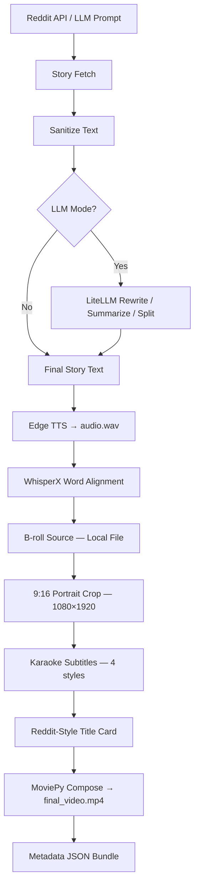

# PyReel

Automate short-form vertical video (9:16) creation for TikTok, Instagram Reels, and YouTube Shorts.

Given a Reddit post or an LLM-generated story, PyReel handles the entire production pipeline in a single `generate()` call — from text acquisition through final `.mp4` render.

---

## Pipeline Overview



---

## System Requirements

!!! warning "Install system dependencies before installing PyReel"

    PyReel calls FFmpeg and ImageMagick as subprocesses. They must be available on your `PATH`.

=== "macOS"

    ```bash
    brew install ffmpeg imagemagick
    ```

=== "Ubuntu / Debian"

    ```bash
    sudo apt install ffmpeg imagemagick
    ```

=== "Windows"

    Download and install:

    - [FFmpeg](https://ffmpeg.org/download.html)
    - [ImageMagick](https://imagemagick.org/script/download.php)

    Add both to your system `PATH`.

Python **3.11 or newer** is required.

---

## Installation

=== "pip"

    ```bash
    pip install git+https://github.com/tuckertrost/PyReel.git
    ```

=== "uv"

    ```bash
    uv pip install git+https://github.com/tuckertrost/PyReel.git
    ```

---

## Quick Start

Verify your system dependencies first:

```python
import pyreel

pyreel.check_dependencies()
```

Then generate a video from a Reddit post:

```python
import pyreel

config = pyreel.PyReelConfig(
    reddit_client_id="YOUR_CLIENT_ID",
    reddit_client_secret="YOUR_CLIENT_SECRET",
    story_mode=pyreel.StoryMode.FETCH,
    broll_local_path="./data/broll/gameplay.mp4",
    output_dir="./output",
)

paths = pyreel.generate(subreddit="AmItheAsshole", config=config)
print(f"Video ready: {paths[0]}")
```

!!! tip "Reddit API credentials"

    Create a Reddit app at [reddit.com/prefs/apps](https://www.reddit.com/prefs/apps) to get your
    `client_id` and `client_secret`. Select **script** as the app type.

---

## Output Structure

Each `generate()` call creates a timestamped run directory:

```
output/
  run_20260415_120000_aita-neighbour/
    final_video.mp4      # always kept
    metadata.json        # always kept
    story_final.txt      # always kept
    run_config.json      # always kept
    audio.wav            # deleted unless keep_artifacts=True
    alignment.json       # deleted unless keep_artifacts=True
    broll_raw.mp4        # deleted unless keep_artifacts=True
    broll_cropped.mp4    # deleted unless keep_artifacts=True
```

If a run is interrupted, re-running with the same config resumes from the last completed stage automatically (checkpoint system).

---

## Next Steps

- [API Reference](API.md) — full documentation for `generate()`, `PyReelConfig`, all enums, config dataclasses, exceptions, and `check_dependencies()`
- [Code Examples](code-examples.md) — end-to-end examples for every major PyReel feature
